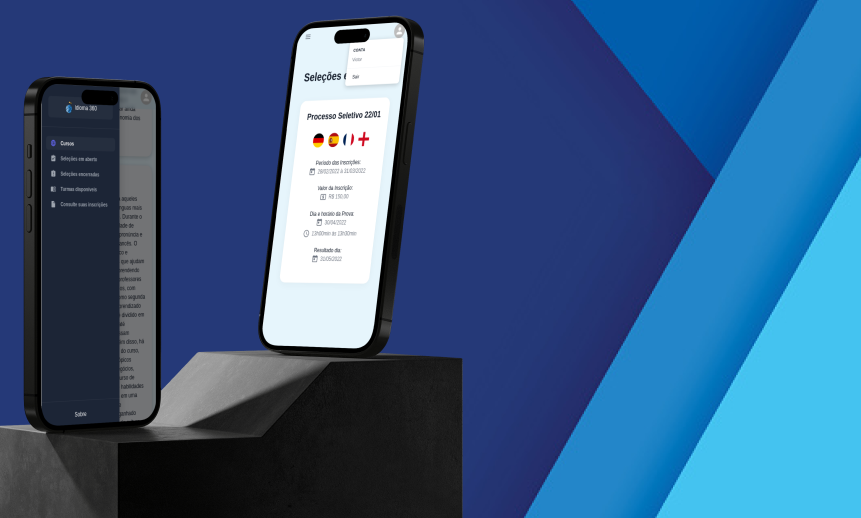

| [:gb:](README.md) | [:brazil:](README_pt.md) |

# Idioma 360 - Back-end

Back-end para o Idioma 360, um gerenciador de cursos de idiomas. :earth_americas:



## Sobre

O Idioma 360 é uma aplicação web abrangente projetada para o gerenciamento de uma plataforma de cursos de idiomas. Essa plataforma versátil atende a dois grupos de usuário distintos: administradores e estudantes.

Com o Idioma 360, os administradores têm controle total sobre as funcionalidades da plataforma. Eles podem facilmente criar, editar e excluir cursos, turmas, processos seletivos e provas. Isso garante que os administradores tenham as ferramentas necessárias para manter e aprimorar a experiência de aprendizado dos alunos.

Os alunos, por outro lado, se beneficiam da interface amigável do Idioma 360. Eles têm a capacidade de se inscrever em vários processos seletivos e participar de testes correspondentes. Isso capacita os alunos a se envolverem ativamente na jornada de aprendizado de idiomas e demonstrarem seus conhecimentos e habilidades.

O Idioma 360 visa facilitar os processos seletivos tanto para os organizadores quanto para os participantes. Essa plataforma é projetada para simplificar e agilizar a experiência de todo o processo seletivo, beneficiando tanto os organizadores quanto os participantes envolvidos.

Você pode acessar o repositório do front-end em [Front-End APP](https://github.com/victor-azevedo/front-idioma360)

## Deploy

Você pode acessar a aplicação [aqui](https://idioma360.vercel.app)
Por favor, observe que, devido ao fato de ser um deploy gratuito, pode haver um tempo de carregamento mais longo ao iniciar a aplicação ⏳. Agradecemos sua paciência 🙏!

## Como executar

### Opção Local:

#### Requisitos

Tenha o Node.js (versão recomendada: 16.20.0) e o PostgresSQL (versão recomendada: 15.2) instalados em sua máquina.

1. Clone este repositório;

```bash
git clone git@github.com:victor-azevedo/back-idioma360.git
cd back-idioma360/
```

2. Instale todas as dependências:

```bash
npm i
```

3. Crie um arquivo `.env` com base no arquivo `.env.example`;

4. Compile o código TypeScript, migre e popule o banco de dados:

```bash
npm run build && npm run migration:run && npm run seed
```

5. Inicie a aplicação:

```bash
npm start
```

Porta padrão da aplicação: 4000.

### Opção Docker:

#### Requisitos

Tenha o Docker e o Docker Compose instalados.

1. Clone este repositório;

```bash
git clone git@github.com:victor-azevedo/back-idioma360.git
cd back-idioma360/
```

2. Crie um arquivo `.env` com base no arquivo `.env.example`;

3. Execute o arquivo Docker Compose:

```bash
sudo docker compose up
```

Porta padrão da aplicação: 4000.
